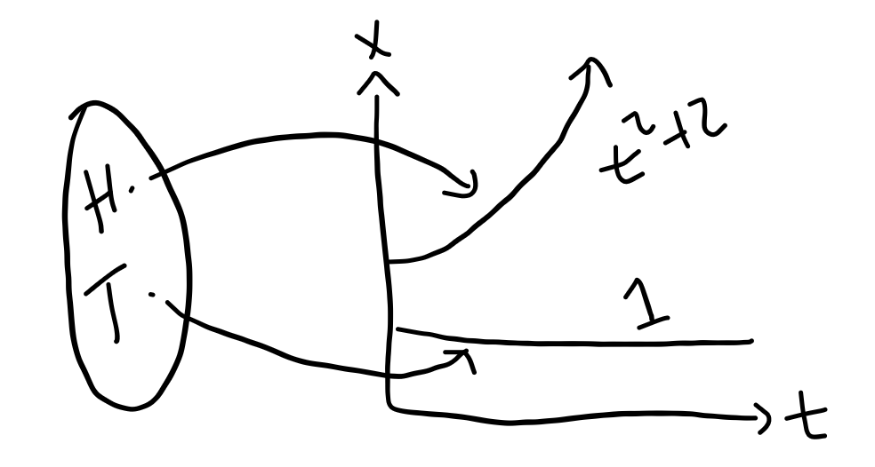

# Primer on Random Variables and Conditional Random Variables

In this section, I want to give two views on conditional probabilities and show how they coincide. The first view is very early in a probability textbook:

$$P(A|B) = \frac{P(A \cap  B)}{P(B)}$$

Also please note that it might appear that $P(A|B)$ is proportional to $P(A)$ perhaps by a proportionality factor such as $1/P(B)$, but that is not true because $P(A)$ is not proportional to $P(A \cap  B)$.  They are truly different distrubutions.  Thus, $P(A|B)$ is totally different from $P(A)$, because $P(A \cap  B)$ is totally different from $P(A)$, which is the crutial insight.  The only situation in which they would be similar would be if $A$ and $B$ are independent, at which point the scaling intuition would be true. 

Next, I want to explain how if two random variables ($X_1$ and $X_2$) are defined on the same event space, observing one random variable, say $X_1$, filters your event space into a smaller event space, and now there is a new random variable that is $X_2$ restricted to that smaller event space. Let's call the value we observe $x_1$.  The new, restricted, event space is $X_1^{-1}(x_1)$, which means it is the inverse image of $x_1$ under the random variable (aka function) $X_1$.  Our notation for this is $X_2 | X_1 = x_1$. Also note that the probability measure defined on the original event space is now modified to a new measure which depends on the observed value of $X_1$.  This measure (of course) adds up to 1, and those elements in the event space previously added up to less than or equal to 1, so in general they get bigger, but the probability of each element does not necessarily increase.  Also, they are not scaled linearly or anything like that -- we do not know how they change until we know the two random variables.

# Stochastic Process Introduction

I want to develop a little intuition between how we think about stochastic processes, for example, the stock market, and how they're defined in a probability book.  First of all, here is a picture:

We have a sample space, $\Omega$, and from that sample space, we map to functions of time (or anything else you want).  We call it a stochastic process, but all it is is a function from a sample space to a space of functions.  The notation is $X_t$, but what's under the hood is the following:

$$X_t = x : \Omega \rightarrow \left(\mathbb{R}^+ \rightarrow  \mathbb{R} \right)$$ 

But we don't really perceive that sample space.  What we perceive (for example when observing the stock market) is that we've observed a process up to a certain time, and we don't know what's going to happen next.  How does that fit into the framework above? Let's start with a picture of a stochastic process.  Here it is, and ignore the 3.5 for now. We'll use it in about two paragraphs.

Let's say this is a stock price over time, and we'll call it $X_t$.  The picture on the right is all the possible trajectories, and the sample space on the left has a corresponding event for each trajectory (I didn't count, so the dots and the trajectories probably don't align, but that's okay).

At our initial time, we have no idea which of these trajectories the stock will take.  But then let's wait a little bit (wait until time 3.5) and observe the price.  Let's say the trajectory we observe is the following:

So now we have information about which of the original trajectories are still possible, and which ones are impossible. This is called a filtration, and in our case, we have the filtration at time 3.5, so we will call it$\mathcal{F}_{3.5}$, but in general, it would be $\mathcal{F}_{t}$.

So now we want to figure out what happens to our stochastic process $X_t$ given the information (aka filtration) we know at time 3.5. What the filtration does is filter out all the trajectories that cannot be the case, and it leaves in all the remaining possible trajectories.  The picture is:

You'll notice that the trajectories that don't align with our filtration are gray, and the events in the sample space that correspond to those trajectories are also gray.  And the trajectories that are possible are still black, and their corresponding events are also still black.

This should feel like a conditional probability, and that's exactly what's happening. We want $Y_t := X_t | \mathcal{F}_{3.5}$.  Thus, $Y_t$ is given by the following drawing:

At this point, we've really explained a lot.  One last part you might be wondering is what would happen if we changed the 3.5.  And you'd be right. So our $Y_t$ is dependent upon our observation duration. So I'll ammend our notation to be $X_t(s) := X_t | \mathcal{F}_{s}$, which means that the stochastic process we get (a.k.a. remaining trajectories) depends on how long we observe.  So we could say that $Y_t = X_t(3.5)$.  So let's draw another picture for another time, say 4.5. We will start with what we've observed by time = 4.5:

And now we can gray out from the picture of $X_t(3.5)$:

And it is hard to see, but one of the elements in the sample space is also grayed out. Which leaves us with our final image of $X_t(4.5)$:

And this time, it's very clear that I miscounted, and there should only be four elements in the sample space corresponding to the four possible trajectories.

Grant, a note to you, you wanted to write about what $X_t(s)$ looks like???

Lastly, I'm working on making a GeoGebra activity to illustrate this. When it's up, I'll update the link, but here is my account for now: https://www.geogebra.org/u/gsmithapples.

# Differentiation and Integration

Here is the best way I know to think about stochastic differentiation and integration. We'll redraw our picture, and its equation and notation are given below.

$$X_t = x : \Omega \rightarrow \left(\mathbb{R}^+ \rightarrow  \mathbb{R} \right)$$ 
$$x(\varsigma_1) = f_1(t)$$
$$x(\varsigma_2) = f_2(t)$$
$$x(\varsigma) = f_\varsigma(t)$$

And note that $x$ is simply a deterministic function.  Also note that we can partially apply and curry however we want, so we also have the following, which will be useful in the following section:

$$X_t = x : \Omega \rightarrow \left(\mathbb{R}^+ \rightarrow  \mathbb{R} \right) = \Omega \rightarrow \mathbb{R}^+ \rightarrow  \mathbb{R} = x :  \left(\Omega  , \mathbb{R}^+\right)\rightarrow  \mathbb{R}$$ 

## Differentiation

We have that:

$$X_t' = \frac{\partial}{\partial t}x(\varsigma,t)= \frac{x\left(\varsigma, t + h\right) - x\left(\varsigma, t\right)}{h} = \frac{f_\varsigma\left(t + h\right) - f_\varsigma\left(t\right)}{h} = \frac{df_\varsigma}{dt} =g\left(\varsigma, t\right)$$

Which means that $X_t'$ is just the probability weighted derivatives of the trajectories. Which, just like $x$, is just a deterministiic function of $\varsigma$ and $t$

Side note that this does not work in Brownian Motion because the individual trajectories in Brownian Motion are not differentiable (anywhere).  I think we might be able to do it with some form of a weak derivative, though, just not the regular one.

Also note that we are using the prime notation for a derivative, but it is a partial derivative. That's okay because $\Omega$ isn't necessarily a continuous variable like $t$ is, so when we're differentiating, it is understood that we're differentiating with respect to the only reasonable option, $t$.

## Integration
We have that:
$$\int X_t= \int_{s = 0}^{s = t} X_s ds = \int_{s = 0}^{s = t} x\left(\varsigma,s\right) ds = \int_{s = 0}^{s = t} f_\varsigma\left(s\right) ds  = h\left(\varsigma,t\right)$$

Which means that $\int X_t$ is just the probability weighted integrals of the trajectories.  Which, just like $x$ and $g$, is just a deterministic function of $\varsigma$ and $t$

I think we can do this with Brownian Motion because even though Brownian Motion trajectories are not (in the normal sense) differentiable, they are integrable.

## Differentiation and Integration Example
Suppose there are only two states of the world, Heads and Tails.  And if Heads is flipped, our world is $x^2 + 2$ and if Tails is flipped, we get $1$.  Our process is:

$$
X_t = \begin{cases} 
    t^2 + 2 & H \\
    1 & T 
 \end{cases}
$$

Then we also know:

$$\int X_t = \begin{cases} 
    \frac{1}{3}t^3 + 2t + C_1 & H \\
    t + C_2 & T 
 \end{cases}
$$
$$X_t = \begin{cases} 
    t^2 + 2 & H \\
    1 & T 
 \end{cases}
$$
$$X'_t = \begin{cases} 
    2t & H \\
    0 & T 
 \end{cases}
$$

And those integration constants are deterministic (i.e. they are just numbers).

# Ito Processes

## Intro

If you have a stochastic process that can be written \textbf{\emph{as a function of}} Ito processes, a.k.a. it can be written \textbf{\emph{in terms of}} Ito processes, then you can write it \textbf{\emph{as}} an Ito Process. And that's what Ito's formula tells us how to do.  This is the equation of an Ito process:

$$Z_t = Z_0 + \int_{0}^{t} u_s ds + \int_{0}^{t} \sigma_s dW_t$$

So if we have a stochastic process given to us in terms of an Ito process like above, then we can write it as above. Mathematically, that means we have a process $Z_t = f(t,X_t)$ where $X_t$ is an Ito process, and we will show that this new stochastic process is itself an Ito process, and we will be able to explicitly state its formula.  This is done with Ito's formula:

$$Z_t = f(t,X_t) = a + \int_{s=0}^{s=t} \frac{\partial f}{\partial t}(s,X_s) + \mu_s \frac{\partial f}{\partial x}(s,X_s) + \frac{1}{2}{\sigma _s}^2\frac{\partial^2 f}{{\partial x}^2}(s,X_s)  ds + \int_{s=0}^{s=t}\sigma_s\frac{\partial f}{\partial x}(s,X_s) dW_s   $$

Which, you will notice, is in the form of an Ito process, which is the goal.  It helps us transform an arbitrary process written in terms of an Ito process ($Z_t$ or $f(t,X_t)$) into an explicitly stated Ito process.

## Derivation

Let's try to approximate $f$ with a Taylor Series.  The statement is the following (and accompanied with the same thing with explicit dependencies):

$$\Delta f = \frac{df}{dt} * \Delta t$$
$$\Delta f(t, \Delta t) = \frac{df}{dt}(t) * \Delta t$$

Where $\Delta f$ is the name of a function, and it now depends on two things: $x$ and $\Delta t$.  What about an approximation with a second order term?  In one dimension, we could have:

$$\Delta f = \frac{df}{dt} * \Delta t + \frac{1}{2} \frac{d^2f}{dt^2} \Delta t ^2$$

And in two dimensions, we would have: 

$$\Delta f = \frac{\partial f}{\partial t} \Delta t + \frac{\partial f}{\partial x} \Delta x + \frac{1}{2}\frac{\partial^2 f}{{\partial t}^2} {\Delta t}^2 + \frac{1}{2}\frac{\partial^2 f}{{\partial t}^2} {\Delta x}^2 +  \frac{\partial^2 f}{\partial t \partial x} \Delta t\Delta x$$

And with dependencies stated explicitly:

$$\Delta f(t,x,\Delta t,\Delta x) = \frac{\partial f}{\partial t}(t,x) \Delta t + \frac{\partial f}{\partial x}(t,x) \Delta x  + \frac{1}{2}\frac{\partial^2 f}{{\partial t}^2}(t,x) {\Delta t}^2 + \frac{1}{2}\frac{\partial^2 f}{{\partial t}^2}(t,x) {\Delta x}^2 +  \frac{\partial^2 f}{\partial t \partial x}(t,x) \Delta t\Delta x$$

Or if we wanted to write it a little differently, instead of using $\Delta$ notation on $t, x$, we could write them at times 1 and 2:

$$\Delta f(t_1,t_2,x_1,x_2) = \frac{\partial f}{\partial t}(t_1,x_1) *[t_2-x_1] + \frac{\partial f}{\partial x}(t_1,x_1) *[x_2-x_1]  + ... $$

$$... +  \frac{1}{2}\frac{\partial^2 f}{{\partial t}^2}(t_1,x_1) * {[t_2-t_1]}^2 + \frac{1}{2}\frac{\partial^2 f}{{\partial x}^2}(t_1,x_1) * {[x_2-x_1]}^2 +  \frac{\partial^2 f}{\partial t \partial x}(t_1,x_1) *[t_2-t_1]*[x_2-x_1]$$

What is the benefit of this different notation instead of the deltas? The benefit is that now it's obvious that when you replace the $t$s or $x$s, you replace the first and second, i.e. you replace the value and the $d$, rather than just the value. 

Now I'm just going to plug in the stochastic $X_t$ for $x$

$$\Delta f(t_1,t_2,X_1,X_2) = \frac{\partial f}{\partial t}(t_1,X_1) *[t_2-t_1] + \frac{\partial f}{\partial x}(t_1,X_1) *[X_2-X_1]  + ... $$

$$... +  \frac{1}{2}\frac{\partial^2 f}{{\partial t}^2}(t_1,X_1) * {[t_2-t_1]}^2 + \frac{1}{2}\frac{\partial^2 f}{{\partial x}^2}(t_1,X_1) * {[X_2-X_1]}^2 +  \frac{\partial^2 f}{\partial t \partial x}(t_1,X_1) *[t_2-t_1]*[X_2-X_1]$$

Here we notice that $X_t$ is also a function of t. So our Taylor series and chain rule can be a little different.  In particular, if we let $\Delta t$ go very small, there might be some behavior in $X_t$ that could help us. What if $f$ is a function of $t$ and $x$, but $X_t$ is also a function of $t$? I think that's what's going on in our problem.  So we have:

$$\Delta f(t_1,t_2,X_{t_1},X_{t_2}) = \frac{\partial f}{\partial t}(t_1,X_{t_1}) *[t_2-t_1] + \frac{\partial f}{\partial x}(t_1,X_{t_1}) *[X_{t_2}-X_{t_1}]  + ... $$

$$... +  \frac{1}{2}\frac{\partial^2 f}{{\partial t}^2}(t_1,X_{t_1}) * {[t_2-t_1]}^2 + \frac{1}{2}\frac{\partial^2 f}{{\partial x}^2}(t_1,X_{t_1}) * {[X_{t_2}-X_{t_1}]}^2 +  \frac{\partial^2 f}{\partial t \partial x}(t_1,X_{t_1}) *[t_2-t_1]*[X_{t_2}-X_{t_1}]$$

But now if we know $X_t$, this is a function of only $t_1$ and $t_2$.  And then we can say $t_2 = t_1 + h$. We can also start calling $t_1$ just $t$

$$\Delta f(t,h) = \frac{\partial f}{\partial t}(t,X_{t}) *h + \frac{\partial f}{\partial x}(t,X_{t}) *[X_{t+h}-X_{t}]  + ... $$

$$... +  \frac{1}{2}\frac{\partial^2 f}{{\partial t}^2}(t,X_{t}) * {h}^2 + \frac{1}{2}\frac{\partial^2 f}{{\partial x}^2}(t,X_{t}) * {[X_{t+h}-X_{t}]}^2 +  \frac{\partial^2 f}{\partial t \partial x}(t,X_{t}) *h*[X_{t+h}-X_{t}]$$

Now we use the fact that $X_t$ is an Ito Process given by:

$$X_t = a + \int_{s=0}^{s=t} \mu_sds + \int_{s=0}^{s=t} \sigma_sdW_s$$

And finding the difference between times $t$ and $t+h$:

$$X_{t+h} - X_t = a + \int_{s=0}^{s=t+h} \mu_sds + \int_{s=0}^{s=t+h} \sigma_sdW_s - \left(a + \int_{s=0}^{s=t} \mu_sds + \int_{s=0}^{s=t} \sigma_sdW_s\right) = $$

$$ =  X_{t+h} - X_t = \int_{s=0}^{s=t+h} \mu_sds - \int_{s=0}^{s=t} \mu_sds+ \int_{s=0}^{s=t+h} \sigma_sdW_s - \int_{s=0}^{s=t} \sigma_sdW_s$$

We now make a temporary notation switch so our work in a few steps will be cleaner, and we will substitute it in:

$$P_t := \int_{s=0}^{s=t} \mu_sds$$
$$Q_t := \int_{s=0}^{s=t} \sigma_sdW_s$$
$$  X_{t+h} - X_t = P_{t+h} -P_t+ Q_{t+h} - Q_t$$

Now plug this in for the step above the Ito Process. 

$$\Delta f(t,h) = \frac{\partial f}{\partial t}(t,X_{t}) *h + \frac{\partial f}{\partial x}(t,X_{t}) *[P_{t+h} -P_t+ Q_{t+h} - Q_t]  + ... $$

$$... +  \frac{1}{2}\frac{\partial^2 f}{{\partial t}^2}(t,X_{t}) * {h}^2 + \frac{1}{2}\frac{\partial^2 f}{{\partial x}^2}(t,X_{t}) * {[P_{t+h} -P_t+ Q_{t+h} - Q_t]}^2 +  \frac{\partial^2 f}{\partial t \partial x}(t,X_{t}) *h*[P_{t+h} -P_t+ Q_{t+h} - Q_t]$$

At this point, we are ready (in a pretty mathematically justifiable way) to do an integration. We'll start at $t=0$ and go up to an arbitrary $t$.  And during this process, we'll add up very small $\Delta f$ values until we get the actual change from $t=0$ to $t$, which will just give us the value at $t$ (assuming we know the value at $t=0$, which we'll assume we do).  It is not obvious yet, but if we can do that, we'll be a lot closer to having our function of $t$ that we want, $Z_t$. 

So let's say we have $n$ partitions of our interval $[0,t]$, and we add up $n$ versions of $\Delta f$ values.  Then our $t$ and $h$ would be:

$$t = \frac{it}{n}, h = \frac{t}{n}$$

And we could sum the equation and reorder the last two terms:

$$Z_t^n = \sum_{i=1}^{i = n} \Delta f\left(ih,h\right) = \sum_{i=1}^{i = n} \frac{\partial f}{\partial t}(ih,X_{ih}) *h + \sum_{i=1}^{i = n}\frac{\partial f}{\partial x}(ih,X_{ih}) *[\Delta P_t+ \Delta Q_t] +  \frac{1}{2}\sum_{i=1}^{i = n}\frac{\partial^2 f}{{\partial t}^2}(ih,X_{ih}) * {h}^2 + ... $$

$$...   + \sum_{i=1}^{i = n} \frac{\partial^2 f}{\partial t \partial x}(ih,X_{ih}) *h*[\Delta P_t+ \Delta Q_t] + \frac{1}{2}\sum_{i=1}^{i = n}\frac{\partial^2 f}{{\partial x}^2}(ih,X_{ih}) * {[\Delta P_t+ \Delta Q_t]}^2$$

and simplifying and collecting terms:

$$Z_t^n = \sum_{i=1}^{i = n} \Delta f\left(ih,h\right) = \sum_{i=1}^{i = n} \frac{\partial f}{\partial t}(ih,X_{ih}) *h + \sum_{i=1}^{i = n}\frac{\partial f}{\partial x}(ih,X_{ih}) *[\Delta P_t] + \sum_{i=1}^{i = n}\frac{\partial f}{\partial x}(ih,X_{ih}) *[\Delta Q_t] +  $$

$$ \frac{1}{2}\sum_{i=1}^{i = n}\frac{\partial^2 f}{{\partial t}^2}(ih,X_{ih}) * {h}^2 + \sum_{i=1}^{i = n} \frac{\partial^2 f}{\partial t \partial x}(ih,X_{ih}) *h*[\Delta P_t] + ... $$

$$...   + \sum_{i=1}^{i = n} \frac{\partial^2 f}{\partial t \partial x}(ih,X_{ih}) *h*[ \Delta Q_t]+ \frac{1}{2}\sum_{i=1}^{i = n}\frac{\partial^2 f}{{\partial x}^2}(ih,X_{ih}) * {[\Delta P_t+ \Delta Q_t]}^2$$

And squaring the $\Delta P_t$ and $\Delta Q_t$ terms and splitting across the sum:

$$Z_t^n = \sum_{i=1}^{i = n} \Delta f\left(ih,h\right) = \sum_{i=1}^{i = n} \frac{\partial f}{\partial t}(ih,X_{ih}) *h + \sum_{i=1}^{i = n}\frac{\partial f}{\partial x}(ih,X_{ih}) *[\Delta P_t] + \sum_{i=1}^{i = n}\frac{\partial f}{\partial x}(ih,X_{ih}) *[\Delta Q_t] +  $$

$$ \frac{1}{2}\sum_{i=1}^{i = n}\frac{\partial^2 f}{{\partial t}^2}(ih,X_{ih}) * {h}^2 + \sum_{i=1}^{i = n} \frac{\partial^2 f}{\partial t \partial x}(ih,X_{ih}) *h*[\Delta P_t]  + \sum_{i=1}^{i = n} \frac{\partial^2 f}{\partial t \partial x}(ih,X_{ih}) *h*[ \Delta Q_t]+ ... $$

$$...  + \frac{1}{2}\sum_{i=1}^{i = n}\frac{\partial^2 f}{{\partial x}^2}(ih,X_{ih}) {\Delta P_t}^2 + \frac{1}{2}\sum_{i=1}^{i = n}\frac{\partial^2 f}{{\partial x}^2}(ih,X_{ih}){\Delta Q_t}^2 + 2\frac{1}{2}\sum_{i=1}^{i = n}\frac{\partial^2 f}{{\partial x}^2}(ih,X_{ih})\Delta Q_t \Delta P_t$$

And now we take the limit at $n$ approaches $\infty$, and a bunch of terms cancel. :

$$Z_t^\infty = f(t,X_t) - f(0,X_0) = \int_{s=0}^{s=t} \frac{\partial f}{\partial t}(s,X_s) ds + \int_{s=0}^{s=t}\frac{\partial f}{\partial x}(s,X_s) d P_s + \int_{s=0}^{s=t}\frac{\partial f}{\partial x}(s,X_s) d Q_s +  $$

$$...  +  \frac{1}{2}\sum_{i=1}^{i = \infty}\frac{\partial^2 f}{{\partial x}^2}(ih,X_{ih}){\Delta Q_t}^2 $$

And focusing on the top line, we can substitute back in for $P_s$ and $Q_s$:

$$Z_t^\infty = f(t,X_t) - f(0,X_0) = \int_{s=0}^{s=t} \frac{\partial f}{\partial t}(s,X_s) ds + \int_{s=0}^{s=t}\frac{\partial f}{\partial x}(s,X_s) \mu_s d s + \int_{s=0}^{s=t}\frac{\partial f}{\partial x}(s,X_s) \sigma_sdW_s +  $$

$$...  +  \frac{1}{2}\sum_{i=1}^{i = \infty}\frac{\partial^2 f}{{\partial x}^2}(ih,X_{ih}){\Delta Q_t}^2 $$

And again focusing on the top line, we can combine like terms:

$$Z_t^\infty = f(t,X_t) - f(0,X_0) = \int_{s=0}^{s=t} \frac{\partial f}{\partial t}(s,X_s) + \mu_s \frac{\partial f}{\partial x}(s,X_s)  ds + \int_{s=0}^{s=t}\frac{\partial f}{\partial x}(s,X_s) \sigma_sdW_s +  $$

$$...  +  \frac{1}{2}\sum_{i=1}^{i = \infty}\frac{\partial^2 f}{{\partial x}^2}(ih,X_{ih}){\Delta Q_t}^2 $$

And now we focus on the bottom line and given that ${\Delta Q_t}^2$ approaches ${\sigma _t}^2dt$, we get:

$$Z_t^\infty = f(t,X_t) - f(0,X_0) = \int_{s=0}^{s=t} \frac{\partial f}{\partial t}(s,X_s) + \mu_s \frac{\partial f}{\partial x}(s,X_s)  ds + \int_{s=0}^{s=t}\frac{\partial f}{\partial x}(s,X_s) \sigma_sdW_s +  $$

$$...  +  \frac{1}{2}\int_{s=0}^{s=t}\frac{\partial^2 f}{{\partial x}^2}(s,X_s) {\sigma _s}^2 ds $$

And now we can combine like terms again, and we have Ito's formula:

$$Z_t = f(t,X_t) = a + \int_{s=0}^{s=t} \frac{\partial f}{\partial t}(s,X_s) + \mu_s \frac{\partial f}{\partial x}(s,X_s) + \frac{1}{2}{\sigma _s}^2\frac{\partial^2 f}{{\partial x}^2}(s,X_s)  ds + \int_{s=0}^{s=t}\sigma_s\frac{\partial f}{\partial x}(s,X_s) dW_s   $$
